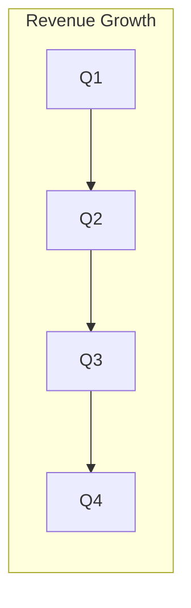

<!-- CONTENT: traction-chart
     SLIDE_TYPE: traction
     LAYOUT: default
     COMPATIBLE_MODES: INVESTOR, UPDATE
     CONTENT_SLOTS: chart_title, chart_description, growth_rate
     ANIMATIONS: v-click for description
     IMPORT: Copy directly into slides.md (replace mermaid with actual data)
     LAST_UPDATED: 2026-04-01
-->

---
layout: default
---

# [SLOT: chart_title]

[SLOT: chart_description]

[SLOT: growth_rate] growth

<!-- Speaker: Walk through the growth trajectory. Emphasize the trend, not individual data points. -->
